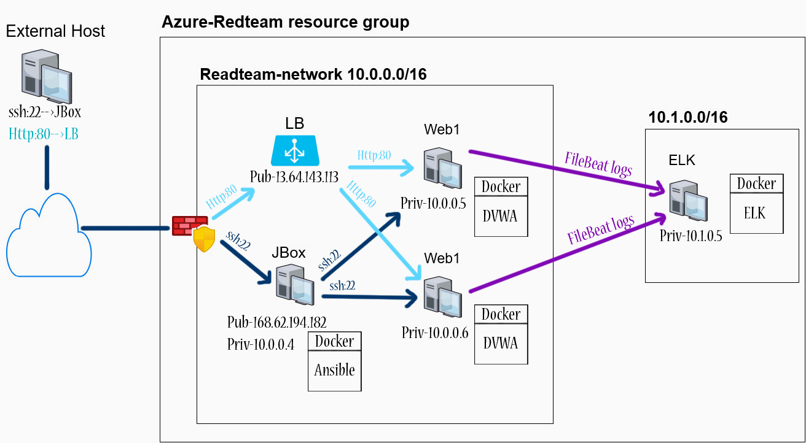
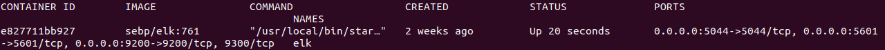
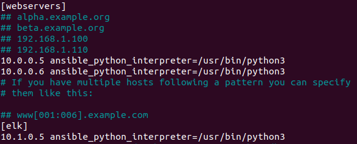
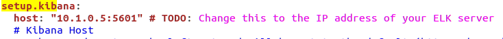
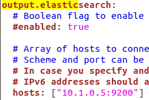

# Automated ELK Stack Deployment

The files in this repository were used to configure the network depicted below.

These files have been tested and used to generate a live ELK deployment on Azure. They can be used to either recreate the entire deployment pictured above or alternatively select portions of the network can be installed.

This document contains the following details:
- Description of the Topology
- Access Policies
- ELK Configuration
  - Beats in Use
  - Machines Being Monitored
- How to Use the Ansible Build

### Description of the Topology

The main purpose of this network is to expose a load-balanced and monitored instance of DVWA, the Damn Vulnerable Web Application.

Load balancing ensures redundancy
- Load balancers route requests from external hosts to webservers ensuring they are not being overloaded (which can cause them to crash or be inaccessable at times). 

A Jump-Box is another layer of security. Users can gain access to the network only by SSH to the Jump-Box using RSA keys, from that machine one can move laterally throughout the network.   

Integrating an ELK server allows users to easily monitor the vulnerable VMs for changes to the application and system logs.
- Filebeat watches for changes to syslog and Authentication logs

The configuration details of each machine can be found below.

| Name     | Function  | IP Address | Operating System |
|----------|-----------|------------|------------------|
| Jump-Box | Gateway   |  10.0.0.4  | Linux            |
| web1     |   dvwa    |  10.0.0.5  | Linux            |
| web2     |   dvwa    |  10.0.0.6  | Linux            |
| elk      |moniter VMs|  10.1.0.5  | Linux            |

### Access Policies

The machines on the internal network (except for the Jump-Box/Load balancer) are not exposed to the Wide Area Network.
To gain access to the internal network, SSH (RSA keys) to the Jump-Box.

- The Web-server machines within the network can only be accessed by the Jump-box ansible container through SSH RSA keys.

- The ELK VM (10.1.0.5) which is located on a seperate network can only be accessed by the Jump-box ansible container through SSH RSA keys.

A summary of the access policies in place can be found in the table below.

| Name       | Publicly Accessible | Allowed IP Addresses                 |
|------------|---------------------|--------------------------------------|
| Jump Box   | Yes (168.62.194.182)| External host containing ssh-priv-key|
|Web1 &web2  | no                  | jumpbox (10.0.0.4)                   |
|LoadBalancer| yes (13.64.143.113) | All				  |	
|   elk      | no                  | jumpbox (10.0.0.4)                   |

### Elk Configuration

Ansible container was used to automate the configuration of the Web servers and ELK host, No configuration was performed manually.

- The main advantage of automating this process is to quickly reconfigure a machine. If multiple VMs were newly created or a previous VM had to be destroyed, we can simply run the playbook to reconfigure our machines. This saves us time rather than manually accessing each machine to install/configure servers.

The ELK playbook implements the following tasks:
- Increases virtual memory for our ELK server to use.
- Installs docker
- Installs python3 and installs the module docker for python
- Downloads the elk image and installs it on a docker container with specific ports for elk to use.

The following screenshot displays the result of running `docker ps` after successfully configuring the ELK instance. (navigate to your elk server and run the following,  docker ps -a)

### Target Machines & Beats
This ELK server is configured to monitor the following machines:
- Web1,Web2, and Jumpbox machines.

We have installed the following Beats on these machines:
- Filebeat was installed on Web1,Web2,Jumpbox machines

These Beats allow us to collect the following information from each machine:
- Filebeat collects data from the syslog and auth logs. 

### Using the ELK Playbook's

In order to use the playbook, you will need to have an Ansible control node already configured. 

SSH into the control node and follow the steps below:
- Copy/download the "install-elk.yml", "filebeat-config.yml", "filebeat-playbook" file onto your ansible container.
- Edit the "hosts" file (/etc/ansible/hosts) to include our elk server/VMs for ansible to use playbooks on.

- Run the "install-elk.yml" playbook (note!:the 'remote_user' inside that file has to be the user containing SSH keys to your elk server)
- edit the "filebeat-config.yml" file to send the data to our ELK server. (IP needs to be the ELK server)

- run the "filebeat-playbook"

- To access Kibana, navigate to 52.151.193.28:5601 in a browser (IP:Port Kibana is using).

